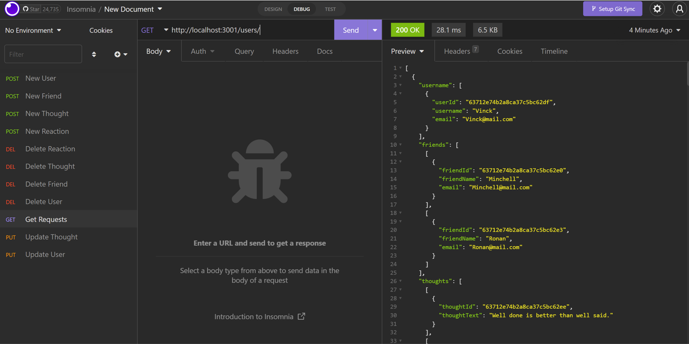
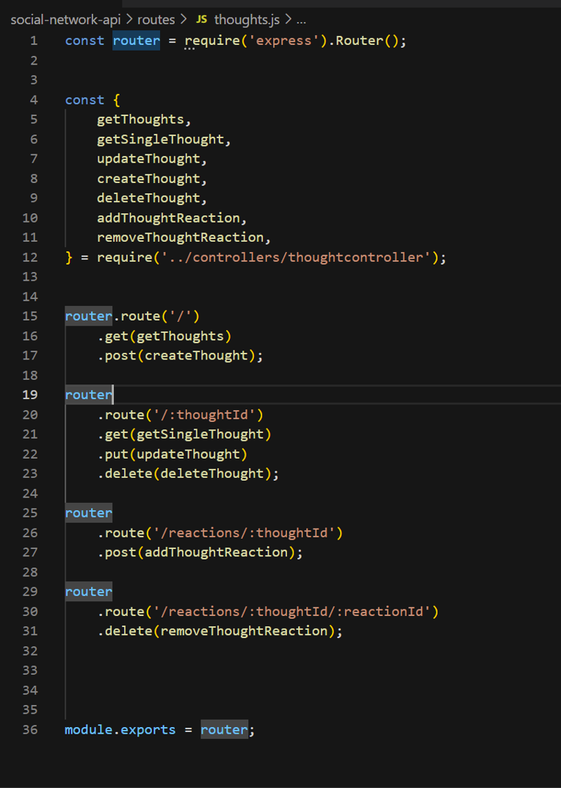
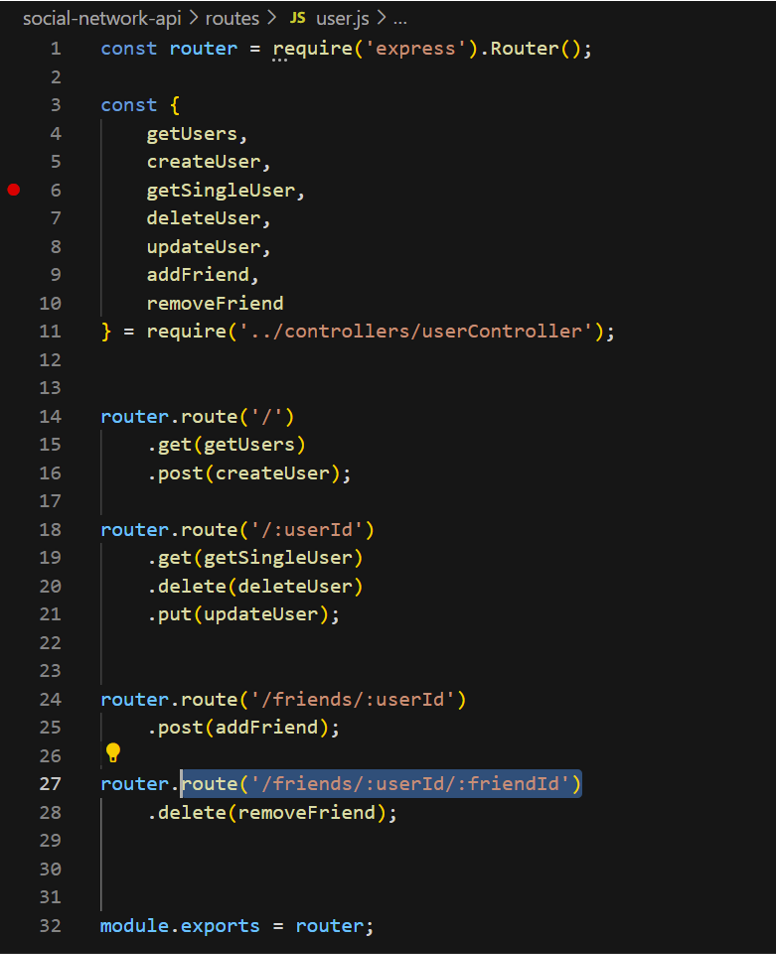

# Social Network API (MongoDB)  

## Table of Contents
- [Description](#description)
- [Installation](#installation)  
- [Usage](#usage)  
- [Questions](#questions)  
  

## Description    

Social Network API (MongoDB) is a backend application that handles a collection of users and thoughts. Users can be created, each user can create thougths, add other users and friends. Also, other users can share reactions to the thoughts of other users.
The app is prepared to make CRUD operations for both Users and Thoughts.  

## Installation    
    
  It is necesarry to install the dependencies required to use the app USING "npm install:

      "express": "^4.17.1",
      "mongoose": "^6.7.1"

## Usage    
    
  The application allows to perform CRUD operations. This operation are done via URL requests in the following routes:  

### THOUGHTS QUERIES

Show all Thoughts in DB:	route('thoughts/'), Method: Get

Create a new Thought:		route('thoughts/'), Method: Post
	request body:
		{
		"thoughtText": "<Describe your thought here>",
		"username": "<UserID that is creating the thought>"
		}	

Show specific thought using Thought ID: 			route('thoughts/:thoughtId'), Method: Get
Update Thought using Thought ID:				route('thoughts/:thoughtId'), Method: Put
	request body:
		{
			"thoughtText": "<New thought>",
			"username": "<UserID that is creating the thought>"
		}

Delete specific Thought using Thought ID:				route('thoughts/:thoughtId'), Method: Delete	

Add a reaction to a Thought using thought ID:			route('thoughts/reactions/:thoughtId'), Method: Post
Delete specific reaction using Thought ID and Reaction ID:	route('/reactions/:thoughtId/:reactionId'), Method: Delete	

### USERS QUERIES  

Show all Users in DB:		route('users/'), Method: Get

Create a new User:		route('users/'), Method: Post
	request body:
			{
				"username": "<Specify name of new user>",
				"email": "<specify name of new user>"
			}

Show specific User using User ID: 			route('users/:UserId') Method: Get

Update User using User ID:					route('users/:UserId') Method: Put
	request body:
		{
			"username": "<Specify new name>",
			"email": "<specify new email>"
		}

Delete specific User using User ID:				route('users/:UserId'), Method: Delete	

Add a new friend to an existib User using UserId:	 route('users/friends/:userId'), Method: Post
	request body:
			{
				"friendId": "<ID of user added as friend>"
			}

Delete friend from user using UserId for both:		route('users/friends/:userId/:friendId'), Method: Delete

  

  

## Questions  
Please refer to my GitHub profile for more information: https://github.com/Lalo79  
If you have questions, you can reach me via e-mail: lalo@mail.com   

